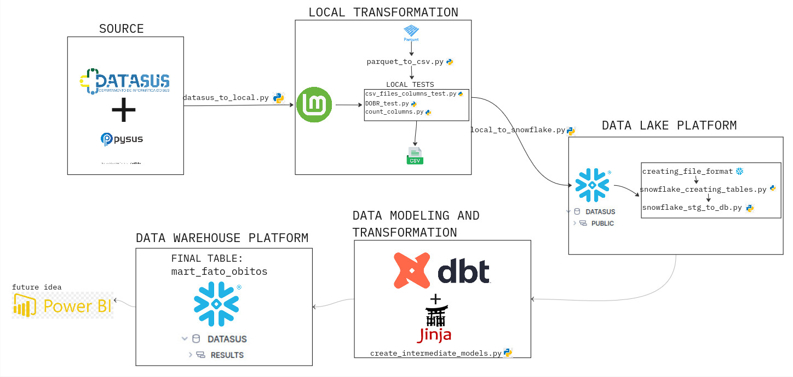
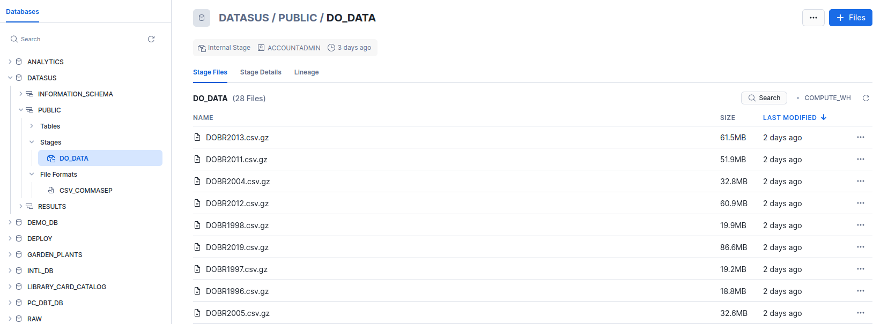
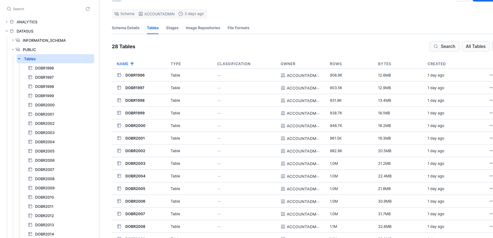
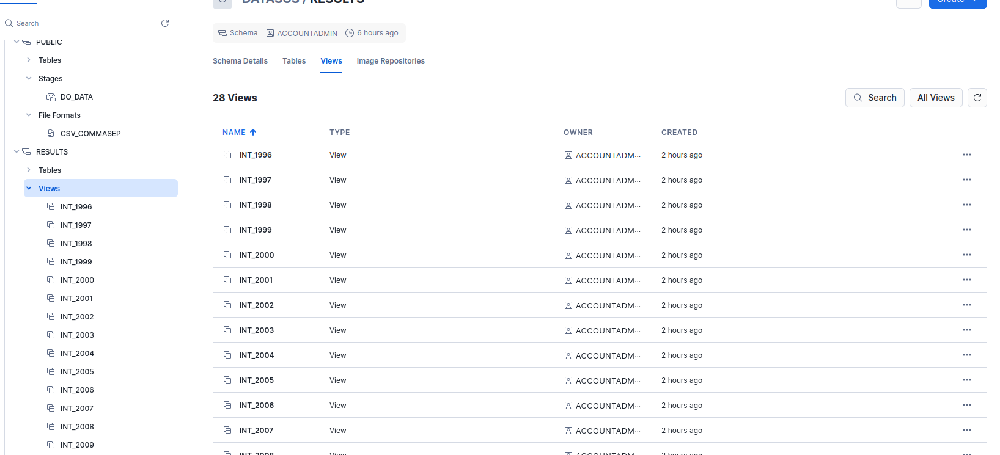
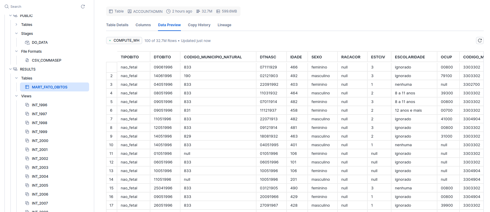

# Projeto Final do Bootcamp da Triggo.ai

## 🚀 Sobre o Projeto
Este é o **projeto final do Bootcamp da Triggo.ai**, desenvolvido para aplicar conhecimentos de **Python, SQL, ETL, Data Analysis e boas práticas de desenvolvimento de software**.  
O objetivo é construir um **pipeline de dados completo**.

[Clique aqui para acessar o pitch](https://youtu.be/XZ9DrtrXVCQ)
---

## Observação
Por segurança minhas credenciais do snowflake não serão disponibilizadas, mas deixo aqui um preview de como os dados se parecem quando o pipeline funciona: 

## Infelizmente ainda não é possível rodar o projeto 😥😥😥
Mas não se preocupe, em breve farei modificações que permitam que qualquer um com uma conta no snowflake possa rodar esse pipeline.

Mas por que não é possível executar o projeto 🤷‍♂️🤷‍♂️🤷‍♂️? 
1. Ele não foi feito com o objetivo de ser executado para o público geral!!! Isso faz parte do desafio do Bootcamp da Triggo.ai portanto essa é uma resolução de um desafio, não um pipeline de código aberto.
2. Esta não é a versão enviada como resolução do desafio!!! A versão enviada está em outro repositório privado, o código desse repositório foi intensamente modificado para evitar a utilização das minhas ❌**credenciais do snowflake**❌.
3. Este trabalho ainda não chegou na sua versão final!!! Ainda faltam muitas modificações para deixar o código mais legível, organizado, modularizado, orquestrado, conteinerizado e de fácil execução.

## Se fosse possível rodar o projeto seria algo do tipo:
- Na pasta home do seu computador um diretorio .dbt deve ser criado e dentro dessa pasta crie um "profiles.yml"
- As dependencias disponiveis dentro de "environment.yml" devem ser instaladas dentro de um virtual environment (nesse projeto o conda foi utilizado)
- Ao instalar as dependencias relacionadas ao dbt, modifique e depopis copie e cole o texto de "profiles.txt" do "profiles.yml" no .dbt
- No terminal rode o comando "dbt debug" para testar a conexão 
- Utilize como base o .env.example e crie um .evn com as suas credenciais do snowflake
- Com todo o ambiente configurado execute os scripts python na seguinte ordem
    1 - datasus_to_local.py
    2 - parquet_to_csv.py
    Antes de seguir os próximos passo apague todas as tabelas e views do database do snowflake "DATASUS" para evitar a duplicação dos arquivos
    3 - local_to_snowflake.py
    4 - snowflake_creating_tables.py
    5 - snowflake_stg_to_db.py
- Assim rode no terminal "dbt run" para trasformar os dados e envia-los para o data warehouse
